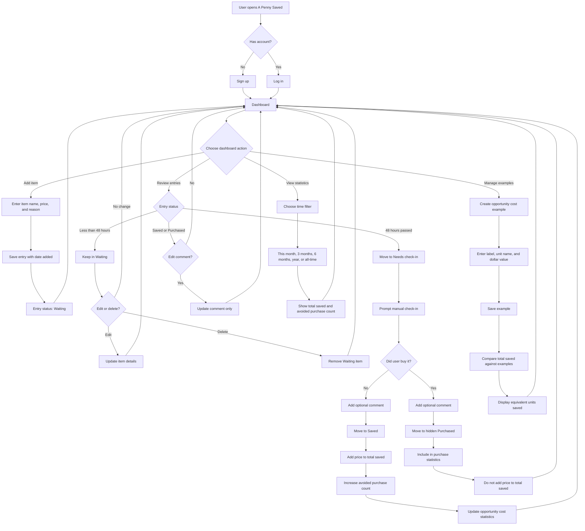

# FLOW-001: Functional Flowchart

This flowchart describes how "A Penny Saved" handles impulse purchase entries, check-ins, savings statistics, and opportunity cost examples.

```mermaid
flowchart TD
    A[User opens A Penny Saved] --> B{Has account?}
    B -- No --> C[Sign up]
    B -- Yes --> D[Log in]
    C --> E[Dashboard]
    D --> E

    E --> F{Choose dashboard action}

    F -- Add item --> G[Enter item name, price, and reason]
    G --> H[Save entry with date added]
    H --> I[Entry status: Waiting]
    I --> E

    F -- Review entries --> J{Entry status}
    J -- Less than 48 hours --> K[Keep in Waiting]
    K --> L{Edit or delete?}
    L -- Edit --> M[Update item details]
    L -- Delete --> N[Remove Waiting item]
    L -- No change --> E
    M --> E
    N --> E

    J -- 48 hours passed --> O[Move to Needs check-in]
    O --> P[Prompt manual check-in]
    P --> Q{Did user buy it?}
    Q -- No --> R[Add optional comment]
    R --> S[Move to Saved]
    S --> T[Add price to total saved]
    T --> U[Increase avoided purchase count]
    U --> V[Update opportunity cost statistics]
    V --> E
    Q -- Yes --> W[Add optional comment]
    W --> X[Move to hidden Purchased]
    X --> Y[Include in purchase statistics]
    Y --> Z[Do not add price to total saved]
    Z --> E

    J -- Saved or Purchased --> AA{Edit comment?}
    AA -- Yes --> AB[Update comment only]
    AA -- No --> E
    AB --> E

    F -- View statistics --> AC[Choose time filter]
    AC --> AD[This month, 3 months, 6 months, year, or all-time]
    AD --> AE[Show total saved and avoided purchase count]
    AE --> E

    F -- Manage examples --> AF[Create opportunity cost example]
    AF --> AG[Enter label, unit name, and dollar value]
    AG --> AH[Save example]
    AH --> AI[Compare total saved against examples]
    AI --> AJ[Display equivalent units saved]
    AJ --> E
```
