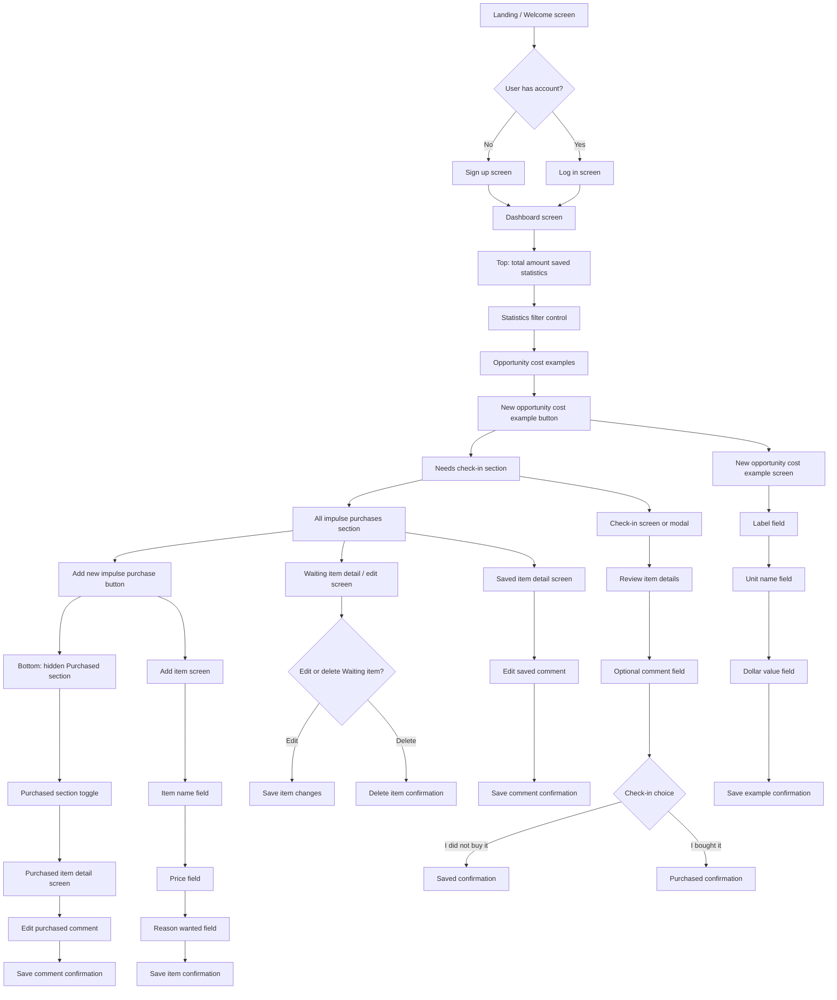

# FLOW-002: Screen Flowchart

This flowchart describes the screens and user navigation for "A Penny Saved."

```mermaid
flowchart TD
    A[Landing / Welcome screen] --> B{User has account?}
    B -- No --> C[Sign up screen]
    B -- Yes --> D[Log in screen]
    C --> E[Dashboard screen]
    D --> E

    E --> F[Top: total amount saved statistics]
    F --> G[Statistics filter control]
    G --> H[Opportunity cost examples]
    H --> I[New opportunity cost example button]
    I --> J[Needs check-in section]
    J --> K[All impulse purchases section]
    K --> L[Add new impulse purchase button]
    L --> M[Bottom: hidden Purchased section]
    M --> N[Purchased section toggle]

    I --> O[New opportunity cost example screen]
    O --> P[Label field]
    P --> Q[Unit name field]
    Q --> R[Dollar value field]
    R --> S[Save example confirmation]

    J --> T[Check-in screen or modal]
    T --> U[Review item details]
    U --> V[Optional comment field]
    V --> W{Check-in choice}
    W -- I did not buy it --> X[Saved confirmation]
    W -- I bought it --> Y[Purchased confirmation]

    L --> Z[Add item screen]
    Z --> AA[Item name field]
    AA --> AB[Price field]
    AB --> AC[Reason wanted field]
    AC --> AD[Save item confirmation]

    K --> AE[Waiting item detail / edit screen]
    AE --> AF{Edit or delete Waiting item?}
    AF -- Edit --> AG[Save item changes]
    AF -- Delete --> AH[Delete item confirmation]

    K --> AI[Saved item detail screen]
    AI --> AJ[Edit saved comment]
    AJ --> AK[Save comment confirmation]

    N --> AL[Purchased item detail screen]
    AL --> AM[Edit purchased comment]
    AM --> AN[Save comment confirmation]
```
